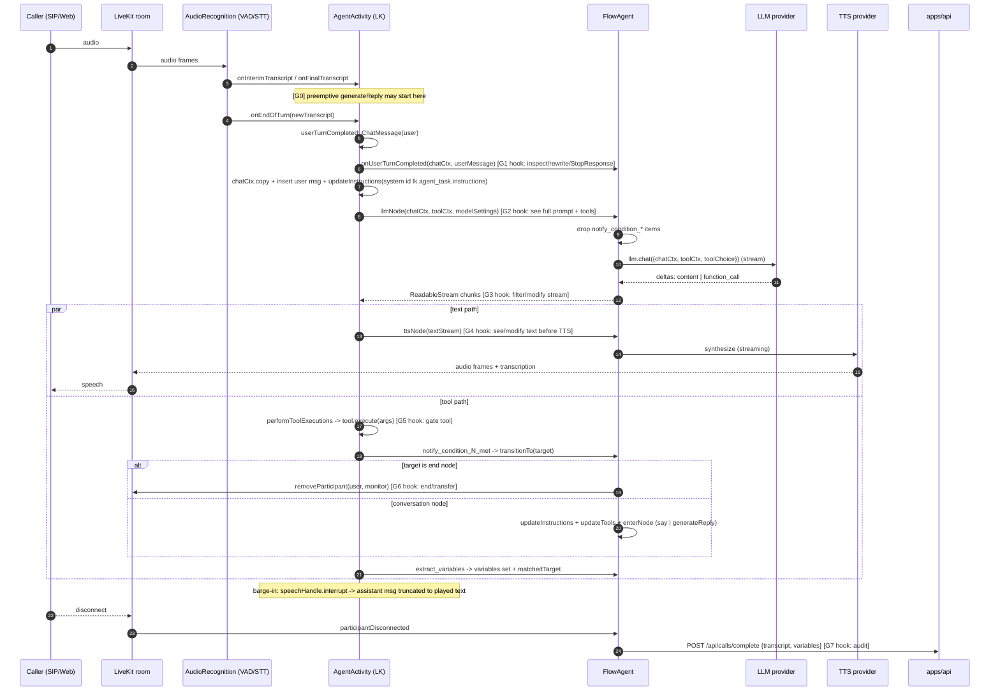

# PhoneFlow: LLM I/O surface inside the voice agent

*Codebase: `angryrobots/` — our fork of PhoneFlow (getphoneflow/phoneflow@40db1ad). File paths below are relative to that folder.*

Date: 2026-09-18
Source: `/Users/danielaguilerairala/HackSpainTeam/phoneflow` (mirror of github.com/getphoneflow/phoneflow), `@livekit/agents@1.7.1`.
Paths below are relative to that repo unless prefixed with `LK/`, which means the LiveKit Agents package at `node_modules/.pnpm/@livekit+agents@1.7.1_*/node_modules/@livekit/agents/dist/`.

## 0. Orientation

The whole model-facing code is ~1,250 lines in `apps/voice-agent/src`. The agent is a `voice.AgentSession` (LiveKit) running a single `FlowAgent extends Agent` subclass (`apps/voice-agent/src/flow/agent.ts:47`). There is exactly **one system prompt** (rebuilt on every node transition), **two tool families** (`notify_condition_N_met`, `extract_variables`), **no user-defined tools**, **no RAG/knowledge lookups**, **no HTTP calls made on behalf of the model**, and the only telephony action the model can trigger is "end the call" via an `end` node. Transfer, DTMF and silence tools do not exist.

Process boundaries:

| Process | Role |
|---|---|
| `apps/voice-agent` (LiveKit Agents worker) | STT -> LLM -> TTS pipeline, tool execution, flow transitions, `endCall()` |
| `apps/api` (Hono) | resolves agent config from DB, inserts/updates `calls` row, starts/stops egress recording, dispatches outbound SIP calls |
| `apps/worker` (BullMQ) | only triggers scheduled batch calls (`POST /api/batch-calls/:id/trigger`) and sends emails |
| LiveKit server | rooms, SIP, egress (recording to S3), agent dispatch |

## 1. INPUTS to the model

### 1.1 System prompt assembly

Built by `buildNodeInstructions(graph, node, variables)` at `apps/voice-agent/src/flow/agent.ts:21-45`. Parts are joined with `"\n\n"` in this fixed order:

1. `PLATFORM_INSTRUCTIONS` (always) — `apps/voice-agent/src/flow/prompts.ts:1-3`. Hidden framing: "provide helpful and informative responses", "answers will be converted to audio, ... do not use symbols like $, %, #, @ or digits ... write them out as words", "answer in around 3-4 sentences".
2. `variables.replace(graph.globalPrompt)` if `globalPrompt` non-empty — from `AgentConfig.globalPrompt` (`packages/shared/src/api/agent-config/schemas.ts:253`).
3. `variables.replace(node.instructions.text)` only when `node.instructions.type === "prompt"` (`agent.ts:32-34`). `"say"` nodes contribute nothing to the system prompt; their text goes straight to TTS (see 2.1).
4. `EXTRACT_INSTRUCTIONS` if the node has `extractVariables` (`prompts.ts:12-15`): "immediately call the `extract_variables` tool ... Do not ask the user for confirmation ... Do not inform the user".
5. `TRANSITION_INSTRUCTIONS` if any outgoing edge has `condition.type === "prompt"` (`prompts.ts:5-10`): "Whenever the condition for one of the available `notify_condition_X_met` tools is met, you should immediately call the corresponding tool ... You don't need to be certain".

Where it lands in the chat context: LiveKit stores it as a single `ChatMessage` with `role: "system"` and fixed `id: "lk.agent_task.instructions"`, always at index 0 (`LK/voice/generation.js:343-367`, `updateInstructions`). On construction it is passed as `super({ instructions })` (`agent.ts:52-54`); on every node transition `this.updateInstructions(...)` (`agent.ts:144-146`) replaces that message in place (`LK/voice/agent_activity.js:702-716`) and also inserts an `AgentConfigUpdate` item into `agent._chatCtx` and `session.history` (those items are dropped by provider formatters, `LK/llm/provider_format/utils.js:30`).

There is no per-turn "extra instructions" injection from PhoneFlow code (`generateReply()` is always called without `instructions`, `agent.ts:155`). LiveKit may prepend its own text only in two cases PhoneFlow does not enable: expressive TTS markup instructions (`expressive: false` default, `LK/voice/agent_session.js:102`) and the "user speaking too long" fallback in `Agent.onUserTurnCompleted` (`LK/voice/agent.js:200-206`, only for `transcriptionTimeout`, which PhoneFlow leaves `null`).

### 1.2 Template variables (`{{var}}`)

Engine: `apps/voice-agent/src/flow/variables.ts`. Pattern `/\{\{\s*([a-z0-9_]+)\s*\}\}/g` (`variables.ts:4`); unknown keys are left verbatim (`variables.ts:47-50`). `replace()` is applied to: globalPrompt, node prompt text, node `say` text (`agent.ts:154`), and edge condition prompts inside tool descriptions (`agent.ts:74`).

Sources of values, in precedence order (later wins):

| Key | Source | File:line |
|---|---|---|
| any `[a-z0-9_]+` key | JSON in participant attribute `variable_values` (string values only) | `variables.ts:7-18, 24` |
| `phone_number` | participant attribute `sip.phoneNumber` (caller's number for inbound, callee for outbound SIP) | `variables.ts:26-29` |
| `date`, `time` | computed at every `replace()` call in `config.timezone ?? "UTC"`, en-US format | `variables.ts:33-45`, `main.ts:65-68` |
| anything set by `extract_variables` | `variables.set(key, String(value))` | `agent.ts:116-118` |

`snapshot()` (`variables.ts:58-66`) strips `date`/`time`/`phone_number` and is what is persisted to `calls.variables` at call end.

Where `variable_values` comes from per channel:

- **Web call**: frontend sets participant attributes `agent_id`, `agent_version_id`, `variable_values: JSON.stringify(variableValues)` on the LiveKit token request (`apps/app/src/components/voice-agent-client.tsx:35-39`); the API `POST /api/token` copies `participant_attributes` verbatim into the JWT (`apps/api/src/routes/token.ts:21-28`, schema `packages/shared/src/api/token/schemas.ts:9`). Any authenticated org member can therefore set arbitrary attributes.
- **Outbound phone call**: `placeOutboundCall()` puts `participantAttributes: { variable_values: JSON.stringify(call.variables) }` on the SIP participant (`apps/api/src/lib/livekit.ts:278-280`). `call.variables` comes from `POST /api/calls/outbound` body `variables` (`apps/api/src/routes/calls.ts:864`, schema `packages/shared/src/api/calls/schemas.ts:67-75`) or from `batch_call_recipients.variables` (`apps/api/src/routes/batch-calls.ts:249`).
- **Inbound phone call**: no `variable_values`; only `sip.phoneNumber` / `sip.trunkPhoneNumber` set by LiveKit SIP.

### 1.3 Runtime identifiers (not templated, used for config resolution)

- Dispatch metadata (`ctx.job.metadata`, parsed at `apps/voice-agent/src/lib/calls.ts:17-19`, type `CallDispatchMetadata` at `packages/shared/src/api/calls/types.ts:25-33`): `direction`, `agentId`, `agentVersionId`, `toNumber`, `fromNumber`, `batchCallId`, `triggeredAt`. Set by `placeOutboundCall` (`livekit.ts:258-268`) or the SIP dispatch rule `{ direction: "inbound" }` (`livekit.ts:189-192`).
- Participant attributes read by the agent: `sip.callStatus` (outbound answer wait, `main.ts:44-50`), `sip.trunkPhoneNumber`, `sip.phoneNumber`, `agent_id`, `agent_version_id`, `variable_values` (`calls.ts:53-85`).
- `startCall()` (`calls.ts:21-95`) POSTs to `/api/calls/start/{outbound|inbound|web}` and receives `{ callId, config: AgentConfig }` — the **entire agent config (prompts, flow graph, model choice) arrives over HTTP at session start**, resolved server-side by `resolveAgentConfig()` (`apps/api/src/routes/calls.ts:63-108`) from `agents.config` or `agent_versions.config` (`packages/db/src/schema/agents.ts:24, 45`).

### 1.4 Conversation history

- STT final transcripts become `ChatMessage{ role: "user", content: transcript, transcriptConfidence }` in `AgentActivity.userTurnCompleted` (`LK/voice/agent_activity.js:2077-2081`), inserted into a copy of `agent.chatCtx` inside `_pipelineReplyTaskImpl` (`agent_activity.js:2363-2366`) and pushed to `agent._chatCtx` after the turn.
- Assistant replies are stored as the **text that was actually played** (`forwardedText`), with `interrupted: true|false` (`agent_activity.js:2722-2736` interrupted branch, `2755-2768` normal). On barge-in the aborted reply is truncated to what was forwarded (`synchronizedTranscript` / playback position), so the model's next context reflects what the user heard, not what was generated.
- Tool calls and outputs are fed back: `FunctionCall` items are pushed as soon as execution starts (`agent_activity.js:2628-2633`) and `FunctionCallOutput` items after (`2799-2802`). For PhoneFlow's tools `execute()` returns `undefined`, so the output is `""` with `replyRequired: false` (`LK/voice/generation.js:326-341`) — **no automatic follow-up LLM call after a tool**; the next generation is triggered by `enterNode()` (2.3) or the next user turn.
- **PhoneFlow filter**: `FlowAgent.llmNode` (`agent.ts:173-185`) drops every item whose `name` starts with `notify_condition_` (both `function_call` and `function_call_output`) before delegating to `Agent.default.llmNode`. `extract_variables` calls/outputs stay in context.
- **No truncation/windowing**: `ChatContext.truncate` exists (`LK/llm/chat_context.js:561`) but is never called for the LLM path; the full history is sent every turn. Multiple system messages are merged by the provider formatter (`LK/llm/provider_format/utils.js:79-90`).
- Preemptive generation (`main.ts:85-91`, enabled by default): the LLM may be called on an interim transcript before end-of-turn; the result is reused only if transcript, chat ctx, tools and toolChoice are unchanged (`agent_activity.js:2138-2160`). A guard must expect **more LLM calls than user turns**.
- Interruption settings come from `config.turnHandling` (`main.ts:70-104`); `minWords` gates whether a short interjection counts as a turn (`agent_activity.js:1659-1671`).

### 1.5 Tool/function schemas presented to the model

Generated per node by `FlowAgent.buildNodeTools(node)` (`agent.ts:60-87`) and installed with `updateTools()` on `onEnter` (`agent.ts:166`) and each transition (`agent.ts:147`). Tools are `tool({...})` from `@livekit/agents` (`LK/llm/tool_context.js:322`).

| Tool name | Parameters (zod) | Description text | Source |
|---|---|---|---|
| `notify_condition_{i}_met` (i = 1..N over outgoing edges with `condition.type === "prompt"`, in edge order) | none (`z.object({})` default) | `Call this tool when the following condition is met: ${variables.replace(edge.condition.prompt)}` | `agent.ts:64-80` |
| `extract_variables` (only if node has `extractVariables`) | `z.object({ [key]: (z.number()\|z.boolean()\|z.string()).describe(description).optional() })` per `ExtractVariable{key,type,description}` | `Call this tool when the user provides some of the requested values` | `agent.ts:89-126`, schema `packages/shared/src/api/agent-config/schemas.ts:144-153` |

No other tools. Edges with `condition.type === "expression"` or `"always"` do not produce tools; they are evaluated in code (2.3). `toolChoice` per call comes from `config.llm.toolChoice` (`auto|none|required`, `schemas.ts:55`); LiveKit forces `"none"` after `maxToolSteps` (default 3, `LK/voice/agent_session.js:93`) or when a reply is generated from inside a tool.

### 1.6 Model / provider selection

`apps/voice-agent/src/providers/llm.ts:11-131`. `config.llm.model` is `"<provider>/<model>"`; the provider prefix selects the plugin. Supported providers: `anthropic`, `baseten`, `cerebras`, `deepinfra`, `deepseek`, `fireworks`, `google`, `groq`, `mistral`, `openai` (Responses API, `llm.ts:92`), `ovhcloud`, `perplexity`, `together`, `xai`. Options passed: `temperature` (all), `maxTokens` (anthropic, baseten, deepinfra, fireworks, google, openai, ovhcloud), `toolChoice` (same set + cerebras), `reasoningEffort` (baseten, deepinfra, fireworks, openai, ovhcloud). API keys from env (`apps/voice-agent/src/lib/env.ts:12-35`). Config schema: `packages/shared/src/api/agent-config/schemas.ts:50-60`. The catalog with pricing is `packages/shared/src/constants/models.ts` (`llm:` block from line 524). Default new-agent LLM: `cerebras/gemma-4-31b` (`packages/shared/src/agents/templates/defaults.ts:9`).

STT providers (`providers/stt.ts`): assemblyai, cartesia, deepgram (+Flux STTv2), elevenlabs, inworld, mistral, openai, ovhcloud, soniox, xai. TTS providers (`providers/tts.ts`): cartesia, deepgram, elevenlabs, fishaudio, inworld, mistral, openai, soniox, xai.

Hidden extra LLM: `keytermsOptions.keytermDetection.enabled` (`schemas.ts:116-130`, passed at `main.ts:76`) turns on LiveKit's keyterm detector which runs a **separate LLM** (`InferenceLLM.fromModelString(DEFAULT_DETECTION_MODEL)`, `LK/voice/keyterm_detection.js:41-52`) over the transcript every `turnInterval` turns with its own system prompt and a `record_keyterms` tool (`keyterm_detection.js:53-80`). Off by default.

## 2. OUTPUTS of the model

### 2.1 Text -> TTS

- Streaming end to end. `performLLMInference` (`LK/voice/generation.js:422-542`) splits the LLM stream into a `textStream` (content deltas) and a `toolCallStream` (function calls). Text deltas are written to a TTS segment writer as they arrive (`agent_activity.js:2403-2470`); a flush sentinel starts a new segment.
- Text transforms before TTS: `ttsTextTransforms: ["filter_markdown", "filter_emoji"]` (`LK/voice/agent_session.js:101`, applied in `generation.js:590`). PhoneFlow relies on the prompt (1.1) to avoid digits/symbols; there is no numeral expansion.
- Sentence chunking: only for non-streaming TTS plugins via `TTSStreamAdapter` + `BasicSentenceTokenizer` (`minSentenceLength: 20`, `streamContextLength: 10`, `LK/tokenize/basic/basic.js:9-10`; `LK/voice/agent.js:373-383`). Streaming plugins receive raw deltas.
- No filler words / thinking sounds. `say` nodes bypass the LLM entirely: `session.say(variables.replace(text))` (`agent.ts:152-154`, `addToChatCtx` default true so it still enters history, `agent_activity.js:1086-1116`).
- Transcription output to the room (`transcriptionNode`, `LK/voice/agent.js:421-423`) is the same text stream; PhoneFlow does not override it.

### 2.2 Tool calls

Executor: `performToolExecutions` (`LK/voice/generation.js:799+`) -> `ToolExecutor.execute` (`LK/voice/tool_executor.js:91`) in the **voice-agent process**. Arguments are JSON-parsed and zod-validated; unknown tool names produce a `ToolError` output ("Unknown function ...") fed back to the model (`generation.js:849-873`). Exceptions are masked as `"An internal error occurred"` (`generation.js:297-306`).

| Tool | Executes | Side effects | Reversible |
|---|---|---|---|
| `notify_condition_{i}_met` | `this.transitionTo(edge.targetNode)` (`agent.ts:75-77`) | if target is `end`: `endCall()` removes the user and monitor participants from the room via `RoomServiceClient.removeParticipant` (`apps/voice-agent/src/lib/end-call.ts:6-26`) — hard hangup. Else: replace system prompt, replace tool set, `enterNode` (speak `say` text or `generateReply()`), possibly chain further transitions. | Hangup: no. Node change: not reversible in code (no back-edge unless the graph has one). |
| `extract_variables` | `variables.set(key, String(value))` for every provided key, then `matchedTarget(node)` and `transitionTo` if an `always`/`expression` edge matches (`agent.ts:115-124`) | mutates in-memory variables (persisted at call end), may transition or hang up | variables overwritten silently; no validation beyond zod type |

Nothing else: no DB writes, no HTTP, no transfer, no DTMF, no participant/room changes other than `removeParticipant` on end.

### 2.3 Flow transitions

Edge condition types (`packages/shared/src/api/agent-config/schemas.ts:217-234`):

- `prompt` — decided **by the model** via `notify_condition_N_met` (1.5). No separate judge LLM call.
- `expression` — decided **in code** by `evaluateExpression` (`apps/voice-agent/src/flow/expression.ts:64-77`) over `Variables` with operators `exists|not_exists|equals|not_equals|contains|not_contains|greater_than|greater_or_equal|less_than|less_or_equal`, `match: all|any`. Evaluated at `matchedTarget()` (`agent.ts:128-136`) after every `extract_variables` call and on entering any node.
- `always` — taken unconditionally at `matchedTarget()`; validated to be the only edge on its source (`schemas.ts:329-340`).

State that changes on `transitionTo(node)` (`agent.ts:138-149`): `agent._instructions` + system message, `agent._toolCtx`, then `enterNode` (`agent.ts:151-162`) which enqueues speech and, if an `always`/`expression` edge matches, awaits `speech.waitForPlayout()` and transitions again. Entering an `end` node calls `endCall()` immediately without a farewell utterance. Start node: `onEnter` installs tools and speaks only if `startSpeaker === "agent"` (`agent.ts:164-171`). There is no node-position state persisted anywhere; the current node exists only as the live instructions/tool set.

### 2.4 End-of-call artifacts

Trigger: `participantDisconnected` for the user participant (`main.ts:107-116`) -> `completeCall(callId, "completed", buildCallTranscript(session.history), variables.snapshot())` -> `POST /api/calls/complete` (`apps/voice-agent/src/lib/calls.ts:131-151`).

- Transcript: `buildCallTranscript` (`apps/voice-agent/src/lib/transcript.ts:5-22`) keeps only `message` items with role `user|assistant` and non-empty text: `{ id, role, content, createdAt }[]`. **Tool calls, system prompts, interrupted flags and per-node context are not persisted.**
- API handler (`apps/api/src/routes/calls.ts:358-434`): rejects if already ended (409); computes `durationMs`; if `IS_CLOUD` computes per-minute costs via `computeCallCosts` (`apps/api/src/lib/call-cost.ts:8-37`, rates from `packages/shared/src/constants/rates.ts` and `models.ts` `usdPerMinute`; **cost is duration-based, not token-based**); `stopCallRecording()`; updates `calls` row (`status, endedAt, durationMs, *Cost, transcript, variables, updatedAt`); `deductOrganizationCredits`.
- Recording: started at call start by the API (`startCallRecording`, `apps/api/src/lib/livekit.ts:131-157`) as a LiveKit room-composite egress, audio-only, `AudioMixing.DUAL_CHANNEL_AGENT`, MP4 to private S3 key `recordings/{callId}.mp4` (`livekit.ts:119-121`); only when private S3 env is configured. Served by `GET /api/calls/:callId/recording` (`calls.ts:502-532`). `session.start({ record: false })` (`main.ts:121`) disables LiveKit's local recorder.
- Unanswered outbound: `recordUnansweredCall` (`calls.ts:97-129`) -> `POST /api/calls/unanswered` inserts a `no_answer` row with zero costs (`calls.ts:301-356`).
- No summaries, no sentiment, no evaluation are generated.

## 3. Data requested from other systems (by the agent, on the model's behalf)

| Moment | Call | From | Detail |
|---|---|---|---|
| Session start | `ctx.job.metadata`, `participant.attributes` | LiveKit | `main.ts:38-39`; dispatch metadata + SIP/web attributes |
| Session start (outbound) | `waitForParticipantAttribute sip.callStatus=active`, 45 s timeout | LiveKit | `main.ts:42-56`; on timeout `deleteRoom()` + unanswered record |
| Session start | `POST {API_URL}/api/calls/start/{web\|inbound\|outbound}` with `Bearer API_TOKEN` | apps/api -> Postgres | `lib/api.ts:8-33`, `lib/calls.ts:21-95`; API reads `agents`, `agent_versions`, `phone_numbers`, credits; inserts `calls`; starts egress |
| Session start | `silero.VAD.load()` in prewarm | local | `main.ts:32-34` |
| Per turn | STT/LLM/TTS provider HTTPS/WebSocket calls | third-party APIs via plugins | `providers/*.ts`; keys from env |
| Per turn (optional) | keyterm detection LLM | LiveKit inference gateway | `LK/voice/keyterm_detection.js:41-52`, only if enabled |
| On tool call | none external | — | in-process only |
| On `end` node / start failure | `RoomServiceClient.removeParticipant` x2 | LiveKit server | `lib/end-call.ts:6-26`; also `lib/calls.ts:91-94` on start failure |
| On user disconnect | `POST /api/calls/complete` | apps/api -> Postgres, LiveKit egress, credits | `main.ts:107-116` |
| Background audio | local MP3 file via `BackgroundAudioPlayer` | local | `main.ts:124-133`, `apps/voice-agent/background/*.mp3` |

No DB access from the voice agent (no `@workspace/db` import), no S3 access, no webhooks, no knowledge base.

### 3.1 Outbound-call trigger (external systems -> model)

`POST /api/calls/outbound` (`apps/api/src/routes/calls.ts:787-873`), auth: org session + permission `calls:create`. Body (`packages/shared/src/api/calls/schemas.ts:67-75`):

```
{ phoneNumberId: uuid, toNumber: e164, agentId: uuid, agentVersionId?: uuid|null, variables?: Record<string,string> }
```

`variables` flows unmodified: request -> `placeOutboundCall({ variables })` (`calls.ts:864`) -> SIP participant attribute `variable_values` (`livekit.ts:279`) -> `createVariables()` (`variables.ts:24`) -> substituted into prompts and tool descriptions. Only keys matching `^[a-z0-9_]+$` with string values survive (`variables.ts:12`). **Values are not sanitized or length-limited; a variable value is injected verbatim into the system prompt** — this is the primary prompt-injection channel. The frontend builds `variables` from `{{...}}` placeholders found in the config (`apps/app/src/hooks/use-variable-values.ts`). Batch calls: `POST /api/batch-calls` stores `recipients[].variables` in `batch_call_recipients.variables` (`packages/db/src/schema/batch-calls.ts:58`), triggered later by the worker via `/batch-calls/:id/trigger` (`apps/worker/src/batch-calls/jobs/process-batch-call.ts`, `apps/api/src/routes/batch-calls.ts:182-268`).

Web calls use the same channel through `POST /api/token` `participant_attributes` (`apps/api/src/routes/token.ts:26`), which is fully caller-controlled.

### 3.2 Call record shape (post-hoc auditor view)

Table `calls` (`packages/db/src/schema/calls.ts:20-97`):

| Column | Type | Notes |
|---|---|---|
| `id` | uuid PK | generated by API at start |
| `organization_id` | text FK organization | |
| `agent_id` | uuid | no FK (historical FKs dropped) |
| `agent_version_id` | uuid FK agent_versions, null = live draft config | which config was used |
| `batch_call_id` | uuid FK batch_calls, nullable | |
| `channel` | `web_call` \| `phone_call` | |
| `direction` | `inbound` \| `outbound` | web calls are `inbound` |
| `status` | `in_progress` \| `completed` \| `no_answer` | never `failed`; crashed sessions stay `in_progress` |
| `from_number`, `to_number` | text | |
| `started_at`, `ended_at` | timestamptz | `ended_at` set only by `/complete` |
| `duration_ms` | int | |
| `stt_model`, `llm_model`, `tts_model` | text | `"provider/model"` snapshot at start |
| `stt_cost`, `llm_cost`, `tts_cost`, `telephony_cost`, `platform_cost`, `total_cost` | numeric(12,6) | cloud only; per-minute |
| `livekit_room_name` | text | `call-<uuid>` for phone; `session-<uuid>` or client-chosen for web |
| `transcript` | json `CallTranscript` | `[{ id, role: user\|assistant, content, createdAt(ms) }]` |
| `variables` | json `Record<string,string>` | final variable state minus `date/time/phone_number` (includes caller-supplied inputs and extracted values, indistinguishable) |
| `created_at`, `updated_at` | timestamptz | |

To reconstruct the prompt an auditor must join `agent_versions.config` (or `agents.config` if `agent_version_id` is null — which may have changed since the call) and re-run `variables.replace` with `calls.variables`; the node sequence and tool calls are not recoverable from the DB. Recording: S3 `recordings/{id}.mp4`. Read APIs: `GET /api/calls`, `GET /api/calls/:id`, `GET /api/calls/export/:organizationId` (`calls.ts:471-500`, token auth).

## 4. One turn (Mermaid)



## 5. Hook points

(a) See the assembled prompt before the LLM call
- `FlowAgent.llmNode(chatCtx, toolCtx, modelSettings)` — `apps/voice-agent/src/flow/agent.ts:173-185`. Already overridden; `chatCtx.items[0]` is the system message (`id === "lk.agent_task.instructions"`), the rest is full history; `toolCtx.functionTools` holds the tool schemas; `modelSettings.toolChoice`. Return `super.llmNode(modifiedCtx, modifiedToolCtx, ...)` or a custom `ReadableStream`. This is the single choke point for every LLM call including preemptive and tool-follow-up generations.
- `buildNodeInstructions()` — `agent.ts:21-45` — to validate/rewrite prompt text and templated variable values at assembly time.
- `Agent.onUserTurnCompleted(chatCtx, newMessage)` — `LK/voice/agent.js:200`, called at `agent_activity.js:2096` — to inspect/modify the user transcript or throw `StopResponse` to suppress a reply (not overridden by PhoneFlow today).
- `createVariables()` / `parseCallValues()` — `apps/voice-agent/src/flow/variables.ts:7-29` — to sanitize inbound variable values before they reach any prompt.

(b) See/modify tool calls before execution
- Wrap the `ReadableStream` returned by `llmNode` (`agent.ts:184`): chunks with `chunk.delta.toolCalls[]` (`{ callId, name, args }`) can be dropped or rewritten before `performLLMInference` writes them to `toolCallStream` (`LK/voice/generation.js:473-486`).
- The tool `execute` bodies themselves: `agent.ts:75-77` (`notify_condition_*`) and `agent.ts:115-124` (`extract_variables`); throwing `ToolError` returns a message to the model, returning a value forces a follow-up LLM turn.
- `FlowAgent.transitionTo(node)` — `agent.ts:138-149` — every node change and every hangup passes through here.
- Session event `AgentSessionEventTypes.FunctionToolsExecuted` (`agent_activity.js:2785`) for post-hoc observation only.

(c) See/modify text before TTS
- Override `ttsNode(text, modelSettings)` on `FlowAgent` (default at `LK/voice/agent.js:366-419`); input is a `ReadableStream<string>` of LLM deltas (after `filter_markdown`/`filter_emoji`). Note `say` nodes also go through `ttsNode` (`agent_activity.js:1086-1116`).
- `transcriptionNode(text)` (`LK/voice/agent.js:421`) for the text shown to the room.
- `FlowAgent.enterNode()` — `agent.ts:151-162` — for `say` text before it is enqueued.
- Session event `ConversationItemAdded` (`agent_session.js:1021`) carries the final assistant message with `interrupted` flag.

(d) End / transfer the call
- `endCall()` — `apps/voice-agent/src/lib/end-call.ts:6-26` — the only hangup primitive; call it from a guard to terminate. There is no transfer primitive; a transfer would need `SipClient.transferSipParticipant` (not present) or a new agent handoff.
- Operator-side: `POST /api/calls/:callId/end` -> `removeCallParticipants` (`apps/api/src/routes/calls.ts:576-606`, `apps/api/src/lib/livekit.ts:103-117`); `POST /api/calls/:callId/join` issues a subscribe-only "monitor" token (`calls.ts:534-574`).
- `session.interrupt()` (`LK/voice/agent_session.js:611`) to cut current speech without hanging up; `session.say()` to inject a guard utterance.

Surprises worth flagging: (1) `notify_condition_*` history is scrubbed from the model's view, so a guard reading `chatCtx` in `llmNode` will not see past transitions unless it tracks them itself; (2) tool outputs are always `""`, so the model never learns whether a transition succeeded; (3) `calls.status` has no failure state and `/complete` is only sent on user disconnect — an agent crash or `endCall()`-then-crash leaves `in_progress` rows; (4) cost accounting is by wall-clock minute, so token-level LLM usage (available via `MetricsCollected` events, `agent_activity.js:1120-1139`) is never recorded; (5) `POST /api/token` lets any org member set arbitrary participant attributes including `agent_id` for any agent id in the DB (`/calls/start/web` does not check organization membership, `calls.ts:110-165`).
